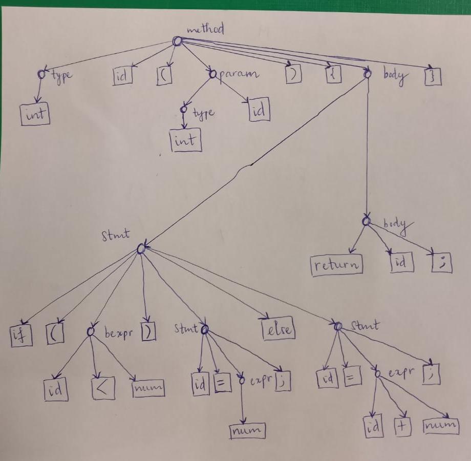

## Aufgabe 1
a.
    1. Falsch
    2. Wahr
b.
    1. Es gibt mindesten eine Ubungsgruppe dieser Vorlesung, in der jede Studierende sein muss, welche diese Vorlesung besucht.
    2. Jede Studierende in Marburg, welche diese Vorlesung besucht, ist in mindestens einer Ubungsgruppe dieser Vorlesung.
    3. Jede Studierende in Marburg ist in mindestens einer Ubungsgruppe dieser Vorlesung.

## Aufgabe 3
a. $A \cap (B \cup C) = (A \cap B) \cup (A \cap C)$

Beweis $\subseteq$:

Sei $x$ ein festes Element in $A \cap (B \cup C)$

$\Rightarrow x \in A \land x \in B \cup C\\
\Leftrightarrow x \in A \land (x \in B \lor x \in C)\\
\Leftrightarrow (x \in A \land x \in B) \lor (x \in A \land x \in C)\\
\Leftrightarrow x \in (A \cap B) \lor x \in (A \cap C)\\
\Leftrightarrow x \in (A \cap B) \cup (A \cap C)$ (1)

Beweis $\supseteq$:

Sei $x$ ein festes Element in $(A \cap B) \cup (A \cap C)$

$\Rightarrow x \in (A \cap B) \cup (A \cap C)\\
\Leftrightarrow x \in (A \cap B) \lor x \in (A \cap C)\\
\Leftrightarrow (x \in A \land x \in B) \lor (x \in A \land x \in C)\\
\Leftrightarrow x \in A \land (x \in B \lor x \in C)\\
\Leftrightarrow x \in A \cap (B \cup C)$ (2)

Von (1) und (2) $\Rightarrow A \cap (B \cup C) = (A \cap B) \cup (A \cap C) \Box$

b.

Beweis $\subseteq$:

Sei $x$ ein festes Element in $(C \setminus A) \cap B$

$x \in (C \setminus A) \cap B\\
\Leftrightarrow (x \in C \land x \notin A) \land x \in B\\
\Leftrightarrow x \in B \land x \in C \land x \notin A\\
\Leftrightarrow x \in B \land x \notin A (da B \subseteq C)\\
\Rightarrow x \in (B \setminus A)$ (1)

Beweis $\supseteq$:

Sei $x$ ein festes Element in $x \in (B \setminus A)$

$x \in (B \setminus A)\\
\Leftrightarrow x \in B \land x \notin A\\
\Leftrightarrow (x \in B \land x \notin A) \land x \in C (da B \subseteq C)\\
\Leftrightarrow x \in C \land x \notin A \land x \in B\\
\Leftrightarrow x \in (C \setminus A) \land x \in B\\
\Leftrightarrow x \in (C \setminus A) \cap B$ (2)

Von (1) und (2) $\Rightarrow (C \setminus A) \cap B = (B \setminus A)$ $\Box$

## Aufgabe 4
a. Wahr, da die leere Menge Teilmenge jeder Menge ist, also $\emptyset \subseteq M$ und es gilt $\emptyset \in \mathcal{P}(M)$
b. Wahr, Es gilt $\forall x \in M: x \in M \Leftrightarrow M \subseteq M$, also $M \in \mathcal{P}(M)$
c. Falsch, da $\mathcal{P}(\emptyset) = \{\emptyset\}$ aber $\{\emptyset\} \subseteq \{\emptyset\}$
d. Wahr, da die leere Menge Teilmenge jeder Menge ist.
e. Falsch, da $M \in \{M\} \subseteq \mathcal{P}(M)$
f. Wahr, da $\emptyset \subseteq M$ gilt $\{\emptyset\} \subseteq \mathcal{P}(M)$

## Aufgabe 2

oder siehe `auf2.png`

