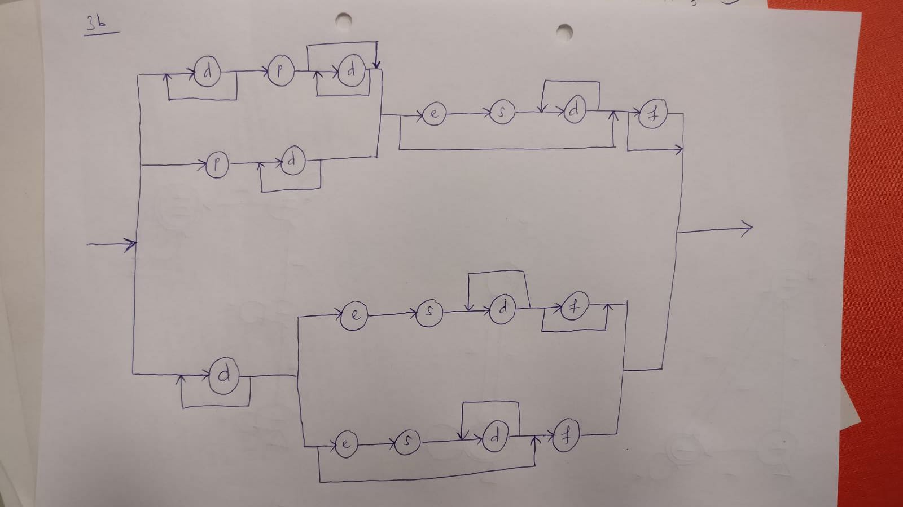
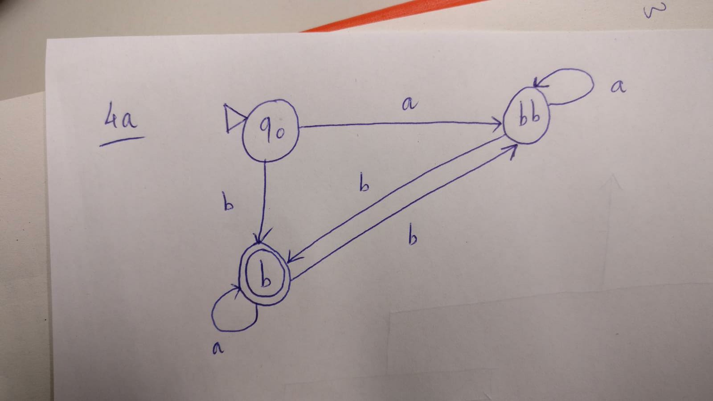
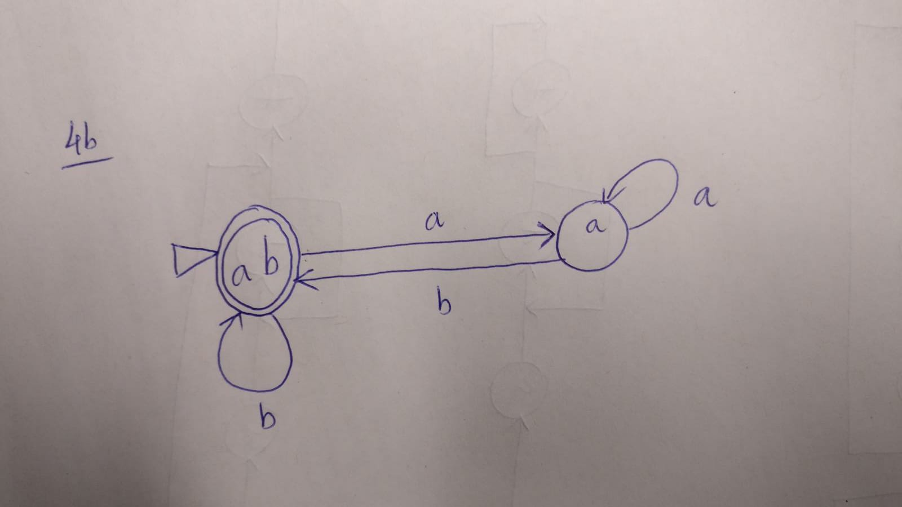
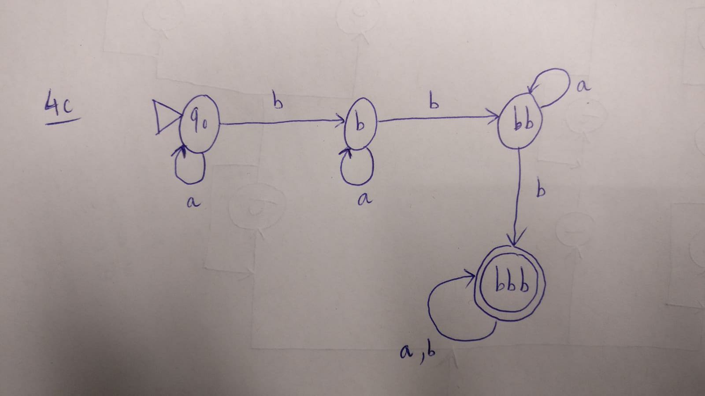

## Aufgabe 1
a.
  1. $r_1 = (0+1)^*(010)(0+1)^*$

  2. $r_2 = (1)^*0(1)^*(01^*01^*)^*$

  3. $r_3 = (00)^*10(00)^*1(00)^*\\
     + (00)^*01(00)^*1(00)^*\\
     + (00)^*1(00)^*10(00)^*$

  4. $r_4 = 0^+1^*(11^+0^*)^*\\
     + 1^+0^*(1^+ + 11^+0^*)^*$

  5. $r_5 = w^*0(010)w^*\\
     + 0w^*(010)w^*\\
     + w^*(010)0w^*\\
     + w^*(010)w^*0$

       mit $w = (1^*01^*01^*)$
b. $r = \emptyset$ oder $r = \epsilon \emptyset$ oder $r = (\emptyset)^*$ oder $r = \emptyset : a \forall a \in \Sigma$

## Aufgabe 2

Es befindet sich eine Fehler in Induktionsschritt

Wir betracten den Fall $n+1 = 2$ (also $n = 1$)

1. Annahme: Es existiert ein rosafarbenes Einhorn innerhalb den $n + 2$ $(2)$ Einhörner.

2. Annahme: Die ersten $n$ Einhörner (also das erste Einhorn) ist rosa.

   Aus den beiden Annahmen kann nicht geschlossen werden, dass das zweite Einhorn rosa sein muss.

   Im Beweis wurde angenommen, dass wenn die ersten $n$ Tiere (von $n+1$ Tieren) Einhörner sind, dann gibt es in den letzten $n$ Tieren mindestens ein Einhorn. Diese Annahme ist aber falsch für $n=1$.
\pagebreak

## Aufgabe 3

a. $\{((letter^+ := digit^+;)^*(letter^+ := digit^+))?\}$

b.

## Aufgabe 4

## Aufgabe 5

a. Ja. Alle drei Eigenschaften werden erfüllt:

  - Reflexivität (R): $\forall a \in A: a \sim a$ ($a$ liegt im selben Bundesland wie $a$)

  - Symmetrie (S): $\forall a_1, a_2 \in A: (a_1 \sim a_2 \Leftrightarrow a_2 \sim a_1)\\a_1$ und $a_2$
    liegen in selben Bundesland genau dann wenn $a_2$ und $a_1$ liegen in selben Bundesland

  - Transitivität (T): $\forall a_1, a_2, a_3 \in A:\\$
    $(a_1 \sim a_2 \sim a_3 \Rightarrow a_1 \sim a_3)$

    Wenn $a_1$ und $a_2$ liegen im selben Bundesland und $a_2$ und $a_3$ auch, dann liegen $a_1$ und $a_3$ im selben Bundesland

b. Nein. Die Transitivität ist  nicht erfüllt. Wenn $m_1 m_2$ kennt und $m_2 m_3$ kennt, gilt night unbedingt, dass $m_1 m_3$ kennt

c. Nein. Die Symmetrie ist nicht erfüllt: Gegenbeispiel: $4 \leq 5$ ist wahr aber $5 \leq 4$ ist falsch

d. Ja. Alle drei Eigenschaften sind erfüllt:

- R: $\forall (a,b) \in \mathbb{Z} \times (\mathbb{Z} \setminus {0})$ gilt:

  $ab - ab = 0 \Leftrightarrow (a,b) \sim (a,b)$

- S: $\forall (a_1,b_1),(a_2,b_2) \in \mathbb{Z} \times (\mathbb{Z} \setminus {0})$ gilt:

  $(a_1,b_1) \sim (a_2,b_2)$

  $\Leftrightarrow a_1 b_2 - a_2 b_1 = 0 \Leftrightarrow \frac{a_1}{b_1} - \frac{a_2}{b_2} = 0$

  $\frac{a_2}{b_2} - \frac{a_1}{b_1} = 0 \Leftrightarrow a_2 b_1 - a_1 b_2 = 0$

  $\Leftrightarrow (a_2, b_2) \sim (a_1, b_1)$

- T: $\forall (a_1, b_1), (a_2, b_2), (a_3, b_3) \in \mathbb{Z} \times (\mathbb{Z} \setminus {0})$

  $(a_1, b_1) \sim (a_2, b_2) \Leftrightarrow a_1 b_2 - a_2 b_1 = 0 \Leftrightarrow \frac{a_1}{b_1} = \frac{a_2}{b_2}$

  Analog $(a_2, b_2) \sim (a_3, b_3) \Leftrightarrow \frac{a_2}{b_2} = \frac{a_3}{b_3}$

  Daraus folgt: $\frac{a_2}{b_2} = \frac{a_1}{b_1} = \frac{a_3}{b_3} \Leftrightarrow a_1 b_3 - a_3 b_1 = 0 \Leftrightarrow (a_1, b_1) \sim (a_3, b_3)$
