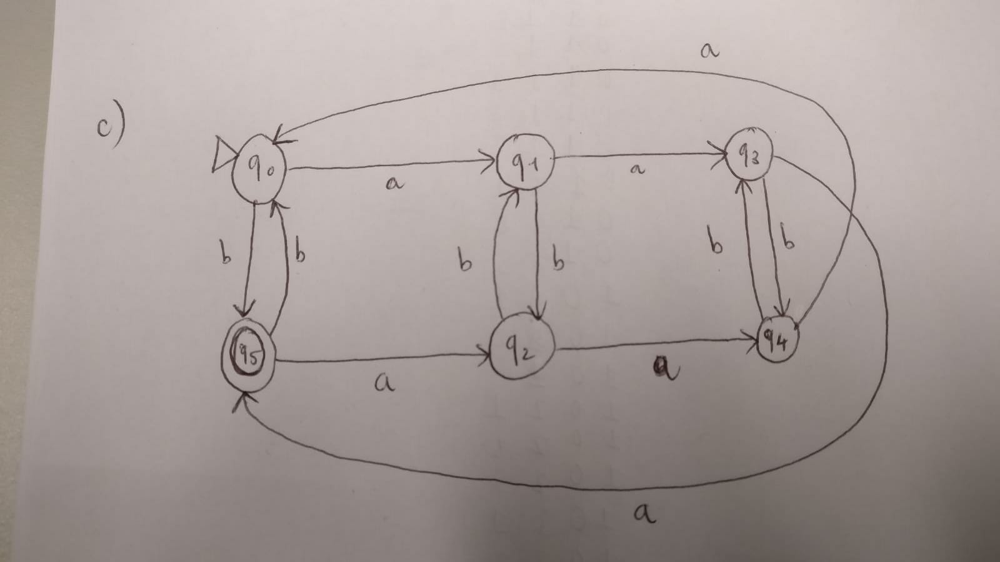
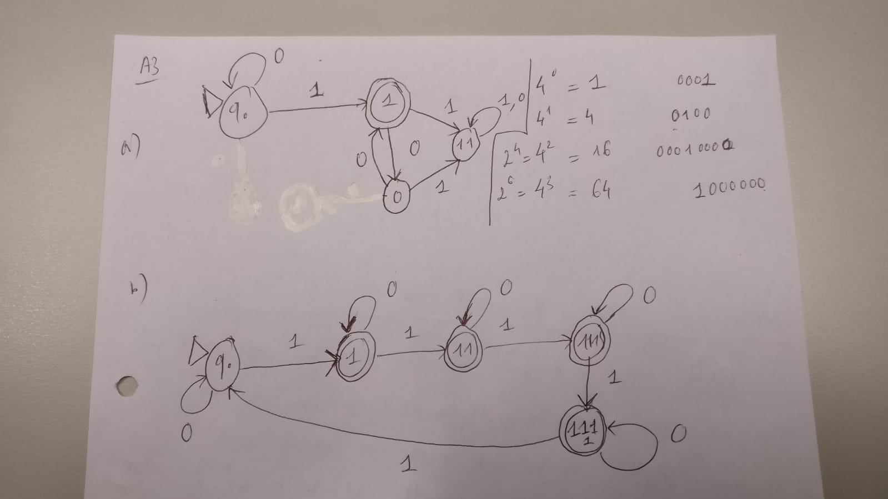

## Aufgabe 1

## Aufgabe 2

a. A = { 011, 012, 013, 021, 022, 023, 031, 032,033, 111, 112, 113, 121, 122, 123, 131, 132, 133}

b. B = { } = $\emptyset$

c. C = { } = $\emptyset$

d. D = {

0011, 0012, 0013,
0021, 0022, 0023,
0031, 0032, 0033,
0111, 0112, 0113,
0121, 0122, 0123,
0131, 0132, 0133,
1011, 1012, 1013,
1021, 1022, 1023,
1031, 1032, 1033,
1111, 1112, 1113,
1121, 1122, 1123,
1131, 1132, 1133,

}

## Aufgabe 3

## Aufgabe 4

Sei $w$ beliebig in $L$

a. $L^* = \cup_{n \geq 0} L^n$

$= \{\epsilon\} \cup L \cup L^2 \cup ...$

$\Rightarrow w \in L^*$

Also $\forall w \in L: w \in L^* \Leftrightarrow L \subseteq L^* \Box$

b. $L^* := \cup_{n \geq 0}L$

$= \{\epsilon\} \cup L^1 \cup L^2 \cup ...$

$\Rightarrow \epsilon \in L^*$

c. $L^* \circ L^*:= \{u \circ v\ |\ u,v \in L^*\}$

Aus Definition, sei $w = u \circ v$ beliebig in $L^* \circ L^*$ mit $u,v \in L^*$

Es gilt $u,v \in L^* \Rightarrow u \circ v \in L^* \Leftrightarrow w \in L^*$

($u,v$ sind Worte (endliche Folgen von Zeichen). Daraus folgt: $u \circ v$ ist auch ein Wort mit endlichen länge und es gilt $u \circ v \in L^*$)

Also $\forall w \in L^* \circ L^*: w \in L^*$, d.h $L^* \circ L^* \subseteq L^*$

d. Zu zeigen: $L^* \subseteq L^{'}$, d.h $\cup_{n \geq 0}L^n \subseteq L^{'}$

Induktionsbeweis:

IA: $n = 0$

$LHS = L^0 = \{\epsilon \}=\subseteq L^{'} = RHS$ (da $\epsilon \in L^{'}$)

IV: $\cup_{0 \leq i \leq n} L^i \subseteq L^{'}$

IS: $\cup_{0 \leq i \leq n+1} L^i = L^0 \cup L^1 \cup L^2 \cup ... \cup L^n \cup L^{n+1}$

$=\cup_{0 \leq i \leq n} L^i \cup L^{n+1}$

$\subseteq (L^{'} \cup L \circ L \circ ... \circ L)$

Da $L \subseteq L^{'}$ und $\circ$ ist monoton, gilt $L \circ L \circ ... \circ L= L^{n=1} \subseteq (L^{'})^{n+1} \subseteq L^{'}$ (da $L^{'} \circ L^{'} \subseteq L^{'}$)

Also: $\cup_{0 \leq i \leq n+1}L^i \subseteq (L^{'} \cup L^{n+1}) \subseteq (L^{'} \cup L^{'}) = L^{'} \Box$

e. Behauptung der Gesamtaufgabe:

Für $L \subseteq \Sigma^*$ gilt:

  1. $L \subseteq L^*$ (gezeigt in Teilaufgabe a)

  "$L^*$ umfasst $L$"

  2. "$L^*$ enthält $\epsilon$": $\epsilon \in L^*$ (gezeigt in Teilaufgabe b)

  3. "Abgeschlossenheit unter Konkantenation":

  $L^* \circ L^* \subseteq L^*$ (gezeigt in Teilaufgabe c)

  4. "$L^*$ ist die keinste Sprache, die **1**, **2**, **3** erfüllt", also für alle Sprachen $L^{'}$, die **1**,**2**,**3** erfüllen gilt $L^* \subseteq L^{'}$

  $\forall L^{'}\ |\ L \subseteq L^{'} \land \epsilon L^{'} \land L^{'} \circ L^{'} \subseteq L^{'}$ gilt $L^* \subseteq L^{'}$ (gezeigt in Teilaufgabe d)
