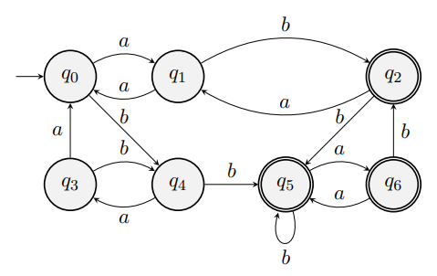

## Aufgabe 1
a. $((a^+ + b^+ a^*)(b + bba^+)^*)?$
b. $a^* (ba^* + bb^+ a)^*$
c. $(b^* ab^* ab^* ab^* ab^* ab^* )^*$

## Aufgabe 2
a. Behauptung: $L_1$ ist nicht regulär, also

$L_1 = \{a^m$ $|$ $m > 0$ ist ein Quadratzahl $\}$ ist nicht durch einen determinitischen endlichen Automaten erkennbar.

  - Angenommen, $L_1$ wäre regulär. Dann gäbe es ein $k$ wie im Pumping Lemma. Jeder k-große ($|w| \geq k$) Wort $w \in L_1$ hätte im k-vorderen Bereich ($|xy| \leq k$) ein nicht leeres Teilwort $y$, das sich "aufpumpen" lässt.
  - Mit dem $k$ von oben betrachten wir jetzt das Wort $w=(a^k)^k$
  1. Es ist in $L_1$
  2. Es ist k-gross ($|w| = k^2 \geq k$)
  - Es musst im k-vorderen Bereich ein Teilwort geben, das sich aufpumpen lässt. Aber wenn wir einen nichtleeren Teil $y$ aufpumpen bekommen wir ein neues Wort $w^{'}$, dessen Länge $|w^{'}|$ keine Quadratzahl ist.

Genauer zu sagen: $|w| = k^2$

Das näschste Wort mit der kleinsten Länge, die aber noch größer als $k^2$ ist, ist $w_0 = (a^{(k+1)})^{k+1}$ mit $|w_0| = (k+1)^2 = k^2 + 2k +1$

Da $0 < |y| \leq k$ gilt $|w^{'}| = k^2 + |y| \leq k^2 + k < k^2 +2k +1$, also $w^{'} \notin L_1$. Widerspruch!

Es gibt daher keinen endlichen Automaten $A$ mit $L_1 = L(A)$.

Daraus folgt: $L_1$ ist nicht regulär. $\Box$

b. $L = \{a^n b^n| n \in \mathbb{N} \land n > 0\}$

Äquivalenzklassen von $L_2 = \{a^n b^n | n \in \mathbb{N} \land n > 0\}$

-  $[\epsilon] = \{\epsilon\}, [a] = \{a\}, [aa] = \{aa\}, ..., [a^k] = \{a^k\} (k \in \mathbb{N}), ...$

- $[ab] = \{ab, a^2 b^2, ...\}, [a^2 b] = \{a^2 b, a^3 b ^2, a^4 b^3,...\}, [a^3 b] = \{a^3 b,a^4 b^2, a^5 b^3,...\}, ...,$

  $[a^k b] = \{ a^{k+i-1} b^i|i \geq 1\} (k\in \mathbb{N}),...$

- $\Sigma^* - L_2 = \{bx, a^n b^m, xbay$ $|$ $x,y \in \Sigma^* \land n,m \in \mathbb{N} \land m > n\}$ mit $\Sigma = \{a,b\}$, also diese Äquivalenzklasse enthält alle Wörte, die nicht in $L_2$ sind.

## Aufgabe 3
a.
- Automat A hat keine nicht erreichbaren Zustände.
- $\Sigma_A = \{a,b\}, F = \{q_2, q_5, q_6\}, Q-F = \{q_0, q_1, q_3, q_4\}$
- Wir beginnen damit, in der Tabelle die Paare zu markieren, bei denen einer in F ist und der andere nicht.

\begin{tabular}{c|c|c|c|c|c|c|c}
  &$q_0$& $q_1$ & $q_2$ & $q_3$ & $q_4$ & $q_5$ & $q_6$ \\ \hline
$q_0$ &\diagbox{}{}&   & x &   &   & x & x \\ \hline
$q_1$ &\diagbox{}{}&\diagbox{}{}& x &   &   & x & x \\ \hline
$q_2$ &\diagbox{}{}&\diagbox{}{}&\diagbox{}{}& x & x &   &   \\ \hline
$q_3$ &\diagbox{}{}&\diagbox{}{}&\diagbox{}{}&\diagbox{}{}&   & x & x \\ \hline
$q_4$ &\diagbox{}{}&\diagbox{}{}&\diagbox{}{}&\diagbox{}{}&\diagbox{}{}& x & x \\ \hline
$q_5$ &\diagbox{}{}&\diagbox{}{}&\diagbox{}{}&\diagbox{}{}&\diagbox{}{}&\diagbox{}{}&   \\ \hline
$q_6$ &\diagbox{}{}&\diagbox{}{}&\diagbox{}{}&\diagbox{}{}&\diagbox{}{}&\diagbox{}{}&\diagbox{}{}
\end{tabular}
- Als nächstes wählen wir $e := a \in \Sigma_A$ und markieren alle $(q_i, q_j)$ $(i<j)$ für die $(\delta(q_i,e), \delta (q_j,e))$ schon markiert ist

\begin{tabular}{c|c|c|c|c|c|c|c}
  &$q_0$& $q_1$ & $q_2$ & $q_3$ & $q_4$ & $q_5$ & $q_6$ \\ \hline
$q_0$ &\diagbox{}{}&   & x &   &   & x & x \\ \hline
$q_1$ &\diagbox{}{}&\diagbox{}{}& x &   &   & x & x \\ \hline
$q_2$ &\diagbox{}{}&\diagbox{}{}&\diagbox{}{}& x & x &\textcolor{red}{x}&\textcolor{red}{x} \\ \hline
$q_3$ &\diagbox{}{}&\diagbox{}{}&\diagbox{}{}&\diagbox{}{}&   & x & x \\ \hline
$q_4$ &\diagbox{}{}&\diagbox{}{}&\diagbox{}{}&\diagbox{}{}&\diagbox{}{}& x & x \\ \hline
$q_5$ &\diagbox{}{}&\diagbox{}{}&\diagbox{}{}&\diagbox{}{}&\diagbox{}{}&\diagbox{}{}&   \\ \hline
$q_6$ &\diagbox{}{}&\diagbox{}{}&\diagbox{}{}&\diagbox{}{}&\diagbox{}{}&\diagbox{}{}&\diagbox{}{}
\end{tabular}
- Wir wiederholen das gleiche mit $e := b$

\begin{tabular}{c|c|c|c|c|c|c|c}
  &$q_0$& $q_1$ & $q_2$ & $q_3$ & $q_4$ & $q_5$ & $q_6$ \\ \hline
$q_0$ &\diagbox{}{}& \textcolor{red}{x} & x &   & \textcolor{red}{x} & x & x \\ \hline
$q_1$ &\diagbox{}{}&\diagbox{}{}& x & \textcolor{red}{x} & \textcolor{red}{x} & x & x \\ \hline
$q_2$ &\diagbox{}{}&\diagbox{}{}&\diagbox{}{}& x & x & x & x  \\ \hline
$q_3$ &\diagbox{}{}&\diagbox{}{}&\diagbox{}{}&\diagbox{}{}&\textcolor{red}{x}& x & x \\ \hline
$q_4$ &\diagbox{}{}&\diagbox{}{}&\diagbox{}{}&\diagbox{}{}&\diagbox{}{}& x & x \\ \hline
$q_5$ &\diagbox{}{}&\diagbox{}{}&\diagbox{}{}&\diagbox{}{}&\diagbox{}{}&\diagbox{}{}&\textcolor{red}{x}   \\ \hline
$q_6$ &\diagbox{}{}&\diagbox{}{}&\diagbox{}{}&\diagbox{}{}&\diagbox{}{}&\diagbox{}{}&\diagbox{}{}
\end{tabular}
- Erneute Versuche mit $e := a$ und $e := b$ bringen eine neue Tabelle, in der alle Feldern markiert sind.

\begin{tabular}{c|c|c|c|c|c|c|c}
  &$q_0$& $q_1$ & $q_2$ & $q_3$ & $q_4$ & $q_5$ & $q_6$ \\ \hline
$q_0$ &\diagbox{}{}& x & x & x & x & x & x \\ \hline
$q_1$ &\diagbox{}{}&\diagbox{}{}& x &  x  & x & x & x \\ \hline
$q_2$ &\diagbox{}{}&\diagbox{}{}&\diagbox{}{}& x & x & x & x  \\ \hline
$q_3$ &\diagbox{}{}&\diagbox{}{}&\diagbox{}{}&\diagbox{}{}& x & x & x \\ \hline
$q_4$ &\diagbox{}{}&\diagbox{}{}&\diagbox{}{}&\diagbox{}{}&\diagbox{}{}& x & x \\ \hline
$q_5$ &\diagbox{}{}&\diagbox{}{}&\diagbox{}{}&\diagbox{}{}&\diagbox{}{}&\diagbox{}{}& x    \\ \hline
$q_6$ &\diagbox{}{}&\diagbox{}{}&\diagbox{}{}&\diagbox{}{}&\diagbox{}{}&\diagbox{}{}&\diagbox{}{}
\end{tabular}
- Die nicht markierten Position in der oberen tabelle zeigen, welche Zustände äquivalent sind (Es gibt aber keine). Hier bestehen die Äquivalenzklassen von $\sim$ aus $\{q_0\},\{q_1\},\{q_2\},\{q_3\},\{q_4\},\{q_5\},\{q_6\}$. Das Automat A ist schon minimal.

{width=60%}

b. Z.z: Der Minimalautomat $A/\sim$ besitzt eine minimale Anzahl an Zuständen

- Sei L die Sprache, die der Automat A erkennt.

  Nach Nerode-Lemma, da A ein DFA ist, gibt es eine minimale endliche Menge von $n$ Worten, die paarweise L-trennbar sind, und daraus folgt, jeder Automat, der L erkennt, hat mindesten $n$ Zustände (inklusiv $A/\sim$)
-  $n$ ist aber auch die Anzahl der Äquivalenzklassen($|R_L|$ - der Index der Sprache L) von L, denn diese $n$ Worte sind paarweise L-trennbar. Zwei Worte $u,v \in \Sigma^*$ sind in derselben Äquivalenzklasse von $L$ $(u$ $R_L$ $v)$ bzgl. L-Trennbarkeit, genau dann wenn $\forall w \in \Sigma^*: (uw \in L \Leftrightarrow vw \in L)$

- Der Minimalautomat $A/\sim$ wird als der Faktorautomat ohne die nicht erreichbaren Zustände

  $A/\sim := (Q/\sim, \Sigma, \delta_{\sim}, [q_0]_{\sim},F_{\sim})$ mit $Q/\sim := \{[q]_{\sim}$ $|$ $q \in Q\}$ aus $A = (Q, \Sigma, \delta, q_0, F)$

  definiert, indem man verhaltensgleiche Zustände identifiziert. Da $A/\sim$ auch L erkennt, und aus der Eigenschaft: in $A/\sim$ sind je zwei verschiedene Zustände trennbar, muss es gelten: die Anzahl der Zuständen in $A/\sim$ ist gleich der Anzahl der Äquivalenzklassen von L, also $|Q/\sim| = n$. D.h der Minimalautomat $A/\sim$ besitzt eine minimale Anzahl an Zuständen.

\pagebreak

## Aufgabe 4

Z.z: $\forall w \in \Sigma^*: \delta_{A\times B}^*((p,q),w) = (\delta_A^*(p,w),\delta_B^*(q,w))$

Induktionbeweis:

**IA**: $w = \epsilon$

$LHS = \delta_{A\times B}^*((p,q),\epsilon) = (p,q)$ //Ausdehnung von $\delta$ auf Worte, 1. Fall in Definition von $\delta^*$

$RHS = (\delta_A^* (p,\epsilon),\delta_B^* (q,\epsilon)) = (p,q)$ // 1. Fall in Definition von $\delta^*$

**IV**: $\forall u \in \Sigma^*: \delta_{A\times B}^* ((p,q),u) = (\delta_A^* (p,u), \delta_B^* (q,u))$

**IS**: Z.z: $\forall a \in \Sigma, \forall u \in \Sigma^*$: $\delta_{A\times B}^* ((p,q),a.u) = (\delta_A^* (p,a.u), \delta_B^* (q,a.u))$

$LHS = \delta_{A\times B}^* ((p,q),a.u)$

$= \delta_{A\times B}^* (\delta_{A\times B} ((p,q),a), u)$ // 2. Fall in Definition von $\delta^*$

$= \delta_{A\times B}^* ((\delta_A(p,a),\delta_B(q,a)),u)$ // Definition von $\delta_{A\times B} ((p,q),a)$ Folie 43 Kap 4

$= (\delta_{A}^* (\delta_A(p,a),u), (\delta_{B}^* (\delta_B(q,a),u)$ // IV

$= (\delta_{A}^* (p,a.u), \delta_{B}^* (p,a.u))$ // 2. Fall in Definition von $\delta^*$

$= RHS$.

Also $\forall w \in \Sigma^*: \delta_{A\times B}^*((p,q),w) = (\delta_A^*(p,w),\delta_B^*(q,w))$ $\Box$
