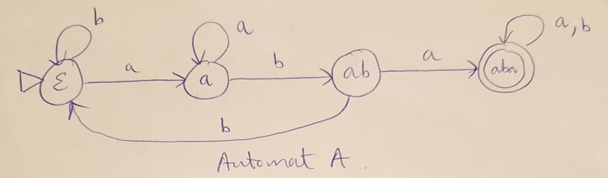
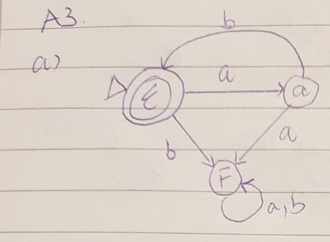
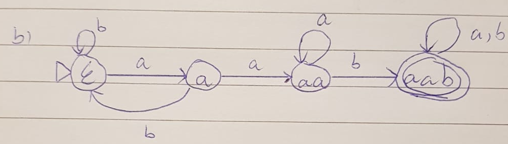
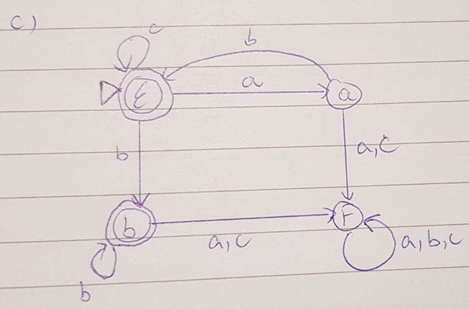

## Aufgabe 1
a.
Wir betrachten die folgende unendliche Menge von L-trennbaren Worten: $\{\epsilon, a, a^2, a^3, ...\}$ ( also die Menge $\{\epsilon\} \cup \{ a^i$ $|$ $i \in \mathbb{N}\})$

Mit $L = \{w \in \Sigma^*|\exists k \leq m \leq n: w = a^k b^n a^m\}$

Für $i \in \mathbb{N}$: $\epsilon$ trennt $\epsilon$ und $a^i$, da $\epsilon \circ \epsilon = \epsilon \in L$ aber $a^i \circ \epsilon = a^i \notin L$

- $\epsilon$ trennt $\epsilon$ und $a$, da $\epsilon \circ \epsilon = \epsilon \in L$ aber $a \circ \epsilon = a \notin L$
- $\epsilon$ trennt $\epsilon$ und $a^2$, da $\epsilon \circ \epsilon = \epsilon \in L$ aber $a^2 \circ \epsilon = a^2 \notin L$
- ...

  Für $p < q (p,q \in \mathbb{N})$

- $b^p a^p$ trennt $a^p$ und $a^q$, da $a^p b^p a^p \in L$ aber $a^q b^p a^p \notin L$

\begin{tabular}{c|c|c|c|c|c}
trennt& $\epsilon$ & $a$ & $a^2$ & $a^3$ & ... \\ \hline
$\epsilon$ &\diagbox{}{}&$\epsilon$&$\epsilon$&$\epsilon$& ...   \\ \hline
$a$ &\diagbox{}{}&\diagbox{}{}& $ba$ & $ba$ & ... \\ \hline
$a^2$ &\diagbox{}{}&\diagbox{}{}&\diagbox{}{}& $b^2 a^2$ & ... \\ \hline
$a^3$ &\diagbox{}{}&\diagbox{}{}&\diagbox{}{}&\diagbox{}{}& ... \\ \hline
$...$ &\diagbox{}{}&\diagbox{}{}&\diagbox{}{}&\diagbox{}{}&\diagbox{}{} \\
\end{tabular}

Nach Nerode Lemma folgt: jeder Automat, der L erkennt, hat unendlich viele Zustände.

$\Rightarrow$ Die Sprache L kann nicht von einem endlichen Automat erkannt werden. $\Box$

b. L hat 4 Äquivalenzklassen: (basiert auf dem minimalen DFA A mit $L(A)=L$) (alle Worte in L enthalten das Teilwort $aba$)

1. $[\epsilon] = b^* (a^+ b b^+)^*$
2. $[a] = b^* a^+ (b b^+ a^+)^*$
3. $[ab] = b^* a^+ b (b^+ a^+ b)^*$
4. $[aba] = (a+b)^* aba (a+b)^*$

{width=80%}

## Aufgabe 2

## Aufgabe 3

Notation: $F$ = Fehlerzustand

a.

{width=60%}

$[\epsilon] = (ab)^*$

$[a] = (ab)^* a$

$[F] = (b + (ab)^* a)(a+b)^*$

b.

{width=60%}

$[\epsilon] = b^*(ab^+)^*$

$[a] = b^* a(b^+ a)^*$

$[aa] = b^* a(b^+ a)^* a^+$

$[aab] = (a+b)^* (aab) (a+b)^*$

c.

{width=60%}

$[\epsilon] = (ab + c)^*$

$[a] = (ab + c)^* a$

$[b] = (ab +c)^* b^+$

$[F] = (ab +c)^*(a+b^+)(a+c)(a+b+c)^*$

## Aufgabe 4
a. Angenommen, L wäre durch einen deterministischen endlichen Automat A erkennbar. Dann gäbe es ein $k$ wie im Pumping Lemma. Jedes k-große ($|w| \geq k$) Wort $w \in L$ hätte im k-vorderen Bereich ($|xy| \leq k$) ein nicht leeres Teilwort $y$, das sich "aufpumpen" lässt.

Mit dem $k$ von oben betrachten wir das Wort $w = a^k b^k$. Es gilt:

1. $w \in L$ (da $|w|_a = |w|_b = k$)
2. $|w| = 2k \geq k$, also $w$ ist k-gross.

Es muss im k-vorderen Bereich ein Teilwort $y$ geben, das sich aufpumpen lässt. Der k-vordere Bereich von $w$ besteht aber nur aus $a$'s. Wenn wir hier einen nichtleeren Teil $y$ aufpumpen, bekommen wir ein Wort mit mehr $a$'s als $b$'s . Das neue Wort wäre nicht merhr in L. Widerspruch!

Es gibt daher keinen endlichen Automat A mit $L = L(A)$ $\Box$

b. Angenommen, L wäre durch einen deterministischen endlichen Automat A erkennbar. Dann gäbe es ein $k$ wie im Pumping Lemma. Jedes k-große ($|w| \geq k$) Wort $w \in L$ hätte im k-vorderen Bereich ($|xy| \leq k$) ein nicht leeres Teilwort $y$, das sich "aufpumpen" lässt.

Mit dem $k$ von oben betrachten wir das Wort $w = uu^R$ mit $u \in \Sigma^*, |u| = k$, $u$ enthält kein Palindrom als Teilwort. Es gilt:

1. $w \in L$
2. $w$ ist k-gross $(|w| = 2k \geq k)$

Es muss im k-vorderen Bereich ein Teilwort $y$ geben, das sich aufpumpen lässt. Aber wenn wir einen nichtleeren Teil $y$ aufpumpen, bekommen wir ein neues Wort $w' = uyu^R$, das tatsächlich kein Palindrom ist. ($(w')^R = uy^R u^R \neq uyu^R = w'$, denn $y$ ist kein Palindrom aus der Voraussetzung von $u$)
