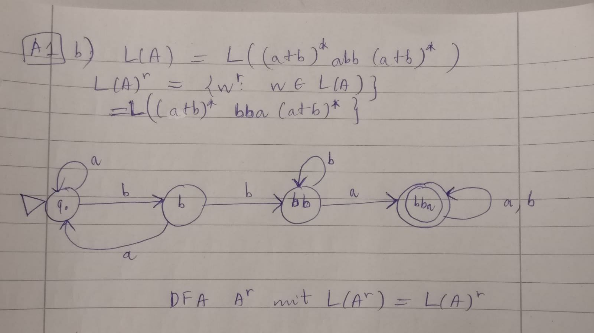
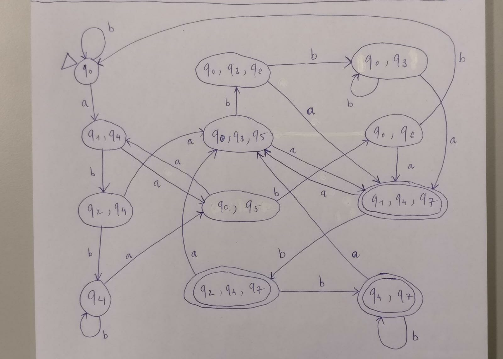
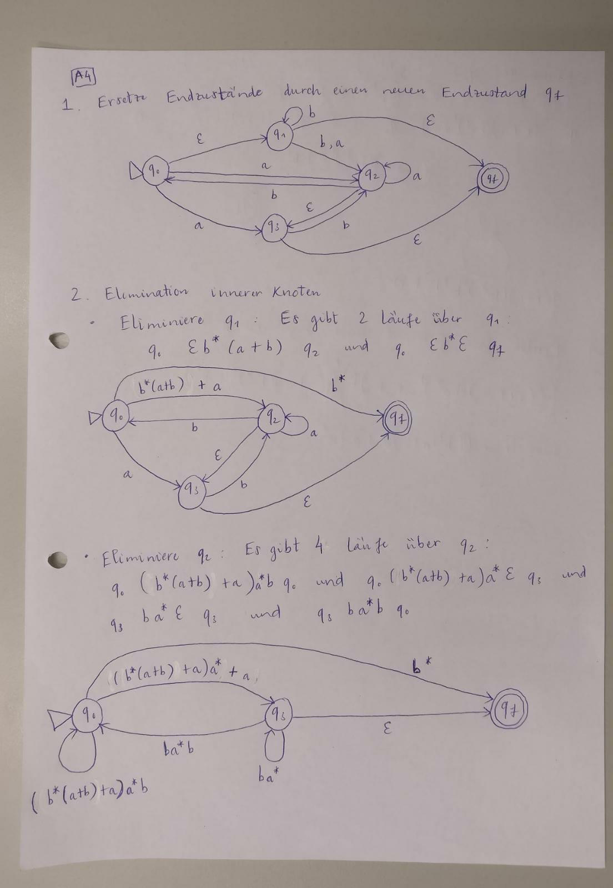
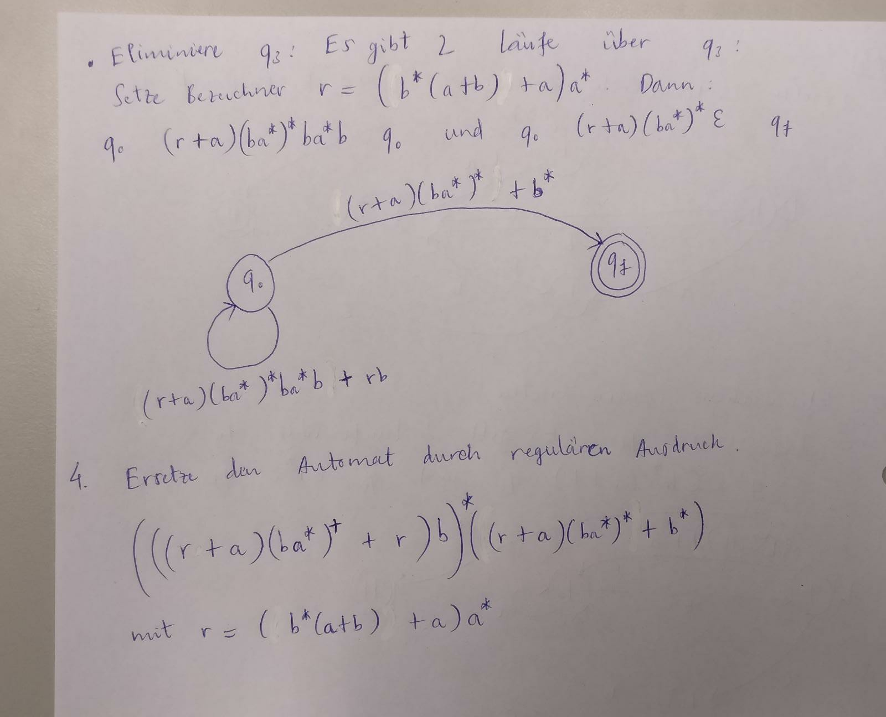

## Aufgabe 1
a. Behauptung: $\forall e \in REG(\Sigma)$ $\exists$ $e^r \in REG(\Sigma)$: $L(e^r) = L(e)^r$

Induktionsbeweis

**IA**:

Falls $e \equiv \emptyset$: Setze $e^r \equiv \emptyset$. Es gilt:

$L(e^r) = L(\emptyset) = \{\} = L(\emptyset)^r = L(e)^r$

Falls $e \equiv \epsilon$: Setze $e^r \equiv \epsilon$. Es gilt:

$L(e^r) = L(\epsilon) = \{\epsilon\} = \{\epsilon^r\} = L(\epsilon)^r = L(e)^r$

(da $\epsilon^r = \epsilon$ aus der ersten Definition von Reversewort)

Falls $e \equiv a$ ($a \in \Sigma$ beliebig). Setze $e^r = a$. Es gilt:

$L(e^r) = L(a) = \{a\} = \{a^r\} = L(a)^r = L(e)^r$

(da $a^r = a$ für jedes $a \in \Sigma$).

**IV**:

Seien $e,f \in REG(\Sigma)$ sodass $\exists$ $e^r, f^r \in REG(\Sigma):$ $L(e^r) \equiv L(e)^r$ und $L(f^r) = L(f)^r$

**IS**:

Fall 1: Alternative

Sei $g = e+f$, also $g \in REG(\Sigma)$. Setze $g^r = e^r + f^r$ (daher ist $g^r \in REG(\Sigma)$). Es gilt:

$L(g)^r = L(e+f)^r = \{w^r: w \in L(e) \cup L(f)\}$ //Definition von $L^r$ und $L(e+f)$

$L(g^r) = L(e^r+f^r) = \{w: w \in L(e^r) \cup L(f^r)\}$ //Definition von und $L(e+f)$

$= \{w: w \in L(e)^r \cup L(f)^r\}$ //IV

$= \{w^r: w \in L(e) \cup L(f)\}$ //Definition von $L^r$

$\Rightarrow L(g)^r = L(g^r)$

Fall 2: Konkatenation

Sei $g = ef$, also $g \in REG(\Sigma)$. Setze $g^r = f^r e^r$ (daher ist $g^r \in REG(\Sigma)$). Es gilt:

$L(g)^r = L(ef)^r = \{w^r: w \in L(e) \circ L(f)\}$ //Definition von $L^r$ und $L(ef)$

$L(g^r) = L(f^r e^r) = \{w: w \in L(f^r) \circ L(e^r)\}$ //Definition von $L(ef)$

$= \{w: w \in L(f)^r \circ L(e)^r\}$ //IV

$= \{uv: u \in L(f)^r, v \in L(e)^r\}$ //Definition von $L_1 \circ L_2$

$= \{m^r n^r: m \in L(f), n \in L(e) \}$ //Definition von $L^r$

$= \{(nm)^r: n \in L(e), m \in L(f)\}$ Definition von Reversewort

$= \{w^r: w \in L(e) \circ L\{f\}\}$ //Definition von $L_1 \circ L_2$

$\Rightarrow L(g^r) = L(g)^r$

Fall 3: Kleene-Star

Sei $g = e^*$, also $g \in REG(\Sigma)$. Setze $g^r = (e^r)^*$ (daher ist $g^r \in REG(\Sigma)$). Es gilt:

$L(g)^r = L(e^*)^r = \{w^r: w \in L(e^*)\}$ Definition von $L^r$

$L(g^r) = L((e^r)^*)$

$= \{w: w \in L(e^r)^*\}$ //Definition von $L(e^*)$

$= \{w: w \in (L(e)^r)^*\}$ //IV

$= \{w^r: w \in L(e)^*\}$ //Basiert auf Fall 2 mit $f \equiv e$

$= \{w^r: w \in L(e^*)\}$ //Definition von $L(e^*)$

$\Rightarrow L(g)^r = L(g^r)$

Damit wird die Behauptung bewiesen $\Box$

b.

c. $L(e) = L(A) \cap L(A)^r$

$= \{w: w \in L(A) \land w \in L(A)^r\}$

$= \{\ w: w \in L(A), w = w^r\}$ ist die Sprache der Palindrome von $L(A)$

Da die Sprache der Palindrome nicht von einem endlichen Automat erkennt werder kann (als bewiesen im Übungszettel 6, Aufgabe 4 mithilfe der Pumpinglemmas) ist es unmöglich, einen regulären Ausdruck $e$ mit $L(e) = L(A) \cap L(A)^r$ zu finden.

## Aufgabe 2
- Aus dem NFA $A$:

\begin{tabular}{c|c|c}
 & a & b \\ \hline
$\mathit{q_0}$ & $q_1, q_4$ & $q_0$ \\ \hline
$q_1$ &  & $q_2$ \\ \hline
$q_2$ & $q_3$ &  \\ \hline
$q_3$ & $q_7$ & $q_3$ \\ \hline
$q_4$ & $q_0, q_5$ & $q_4$ \\ \hline
$q_5$ &  & $q_6$ \\ \hline
$q_6$ & $q_7$ &  \\ \hline
\boldsymbol{$q_7$} & $q_3$ & $q_7$ \\
\end{tabular}

- Mache einen DFA (Mit dem Anfangszustand $q_0$ anfangen):

\begin{tabular}{c|c|c}
 & $a$ & $b$ \\ \hline
$q_0$ & $\{q_1, q_4\}$ & $q_0$ \\ \hline
$\{q_1, q_4\}$ & $\{q_0, q_5\}$ & $\{q_2, q_4\}$ \\ \hline
$\{q_0, q_5\}$ & $\{q_1, q_4\}$ & $\{q_0, q_6\}$ \\ \hline
$\{q_2, q_4\}$ & $\{q_3, q_0, q_5\}$ & $q_4$ \\ \hline
$\{q_0, q_6\}$ & $\{q_1, q_4, q_7\}$ & $q_0$ \\ \hline
$\{q_3, q_0, q_5\}$ & $\{q_7, q_1, q_4\}$ & $\{q_3, q_0, q_6\}$ \\ \hline
$q_4$ & $\{q_0, q_5\}$ & $q_4$ \\ \hline
\boldsymbol{$\{q_1, q_4, q_7\}$} & $\{q_0, q_5, q_3\}$ & $\{q_2, q_4, q_7\}$ \\ \hline
$\{q_3, q_0, q_6\}$ & $\{q_7, q_1, q_4\}$ & $\{q_3, q_0\}$ \\ \hline
\boldsymbol{$\{q_2, q_4, q_7\}$} & $\{q_3, q_0, q_5\}$ & $\{q_4, q_7\}$ \\ \hline
$\{q_3, q_0\}$ & $\{q_7, q_1, q_4\}$ & $\{q_3, q_0\}$ \\ \hline
\boldsymbol{$\{q_4, q_7\}$} & $\{q_0, q_5, q_3\}$ & $\{q_4, q_7\}$ \\ \hline
\end{tabular}

{width=80%}

## Aufgabe 3

## Aufgabe 4

